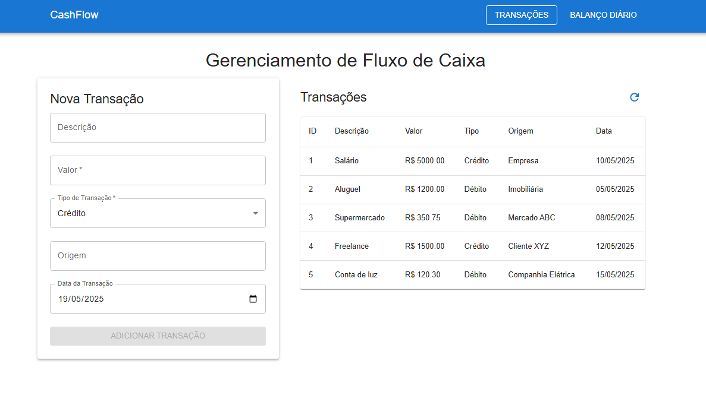
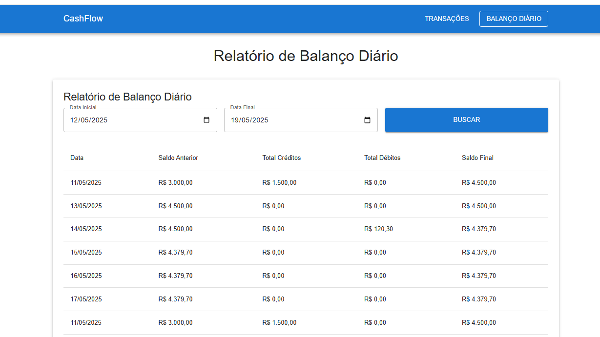

# CashFlow Frontend

Interface de usuário para o sistema de gerenciamento de fluxo de caixa, desenvolvida com React, TypeScript e Material UI.

## Objetivo do Projeto

O CashFlow Frontend serve como interface para o sistema de gerenciamento financeiro, oferecendo uma experiência de usuário intuitiva para:

- Visualizar transações financeiras (créditos e débitos)
- Registrar novas transações com data, valor, tipo e descrição
- Acompanhar o balanço diário automaticamente calculado
- Analisar informações financeiras por períodos específicos
- Suporte a modo offline com dados mockados para desenvolvimento e testes

## Capturas de Tela

### Tela de Transações


### Tela de Balanço Diário


## Executando com Docker

### Pré-requisitos
- Docker
- Docker Compose

### Configuração
1. Clone o repositório
2. Crie um arquivo `.env` na raiz do projeto:
   ```bash
   touch .env
   ```
3. Configure as variáveis de ambiente no arquivo `.env`:
   ```
   REACT_APP_API_URL=http://localhost:8000/api/v1
   REACT_APP_USE_MOCKS=true
   ```

### Executando
Para iniciar a aplicação com Docker Compose:
```bash
docker-compose up -d
```

A aplicação estará disponível em: http://localhost:80

Para parar a aplicação:
```bash
docker-compose down
```

## Executando localmente

### Pré-requisitos
- Node.js (versão 16+)
- npm ou yarn

### Configuração
1. Clone o repositório
2. Instale as dependências:
   ```bash
   npm install
   # ou
   yarn install
   ```
3. Crie um arquivo `.env.local` na raiz do projeto com as seguintes variáveis:
   ```
   REACT_APP_API_URL=http://localhost:8000/api/v1
   REACT_APP_USE_MOCKS=true
   ```

### Executando em desenvolvimento
```bash
npm start
# ou
yarn start
```

A aplicação estará disponível em: http://localhost:3000

### Compilando para produção
```bash
npm run build
# ou
yarn build
```

### Executando testes
```bash
# Executar todos os testes
npm test

# Executar apenas testes de componentes
npm run test:components

# Executar apenas testes de serviços
npm run test:services

# Executar testes com cobertura
npm run test:coverage
```

## Principais Funcionalidades

- **Autenticação**: Sistema de login com token JWT
- **Listagem de Transações**: Visualização de todas as transações com opção de atualização
- **Formulário de Transações**: Interface para cadastro de novas transações
- **Relatório de Balanço Diário**: Visualização do balanço financeiro por períodos
- **Modo Offline**: Suporte a desenvolvimento sem backend através de mocks de dados
- **Design Responsivo**: Interface adaptável a diferentes tamanhos de tela
- **Testes Automatizados**: Cobertura de testes para componentes e serviços

## Tecnologias Utilizadas

- **React 19**: Biblioteca para construção de interfaces
- **TypeScript**: Superset tipado de JavaScript
- **Material UI 7**: Biblioteca de componentes com design Material
- **Axios**: Cliente HTTP para comunicação com API
- **React Router**: Gerenciamento de rotas da aplicação
- **Jest e Testing Library**: Framework de testes
- **Docker**: Containerização para implantação

## Estrutura do Projeto

A aplicação segue uma estrutura organizada por funcionalidade:

- **src/components/**: Componentes reutilizáveis da interface
- **src/contexts/**: Contextos da aplicação, incluindo autenticação
- **src/pages/**: Páginas principais da aplicação
- **src/services/**: Serviços para comunicação com a API
- **src/types/**: Definições de tipos TypeScript
- **src/mocks/**: Dados mockados para desenvolvimento offline
- **src/__tests__/**: Testes automatizados
- **public/**: Arquivos estáticos 

## Autenticação

A aplicação utiliza um sistema de autenticação baseado em token JWT:


- **Comportamento em modo mock**:
  - Quando a variável `REACT_APP_USE_MOCKS=true` está ativa, o sistema de autenticação é automaticamente ignorado
  - Acesso direto às funcionalidades sem necessidade de login
  - Ideal para desenvolvimento e testes rápidos

- **Autenticação em ambiente de produção**:
  - Token JWT armazenado no localStorage
  - Interceptor do Axios para inclusão do token em todas as requisições
  - Rotas protegidas que redirecionam para o login quando não autenticado
  - Expiração do token gerenciada automaticamente

## Comunicação com Backend

A aplicação se comunica com o backend através de uma API RESTful. A configuração da URL da API é feita através da variável de ambiente `REACT_APP_API_URL`.

Para desenvolvimento sem backend, a aplicação suporta um modo de mock que pode ser ativado através da variável de ambiente `REACT_APP_USE_MOCKS=true`.


